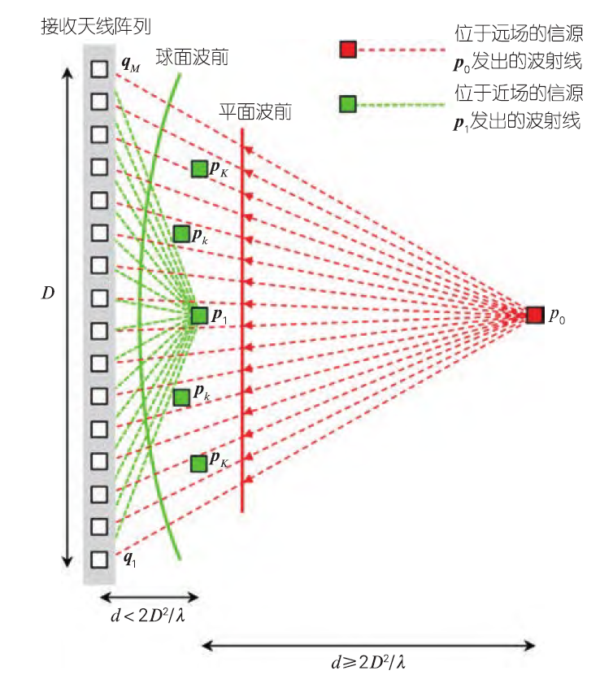
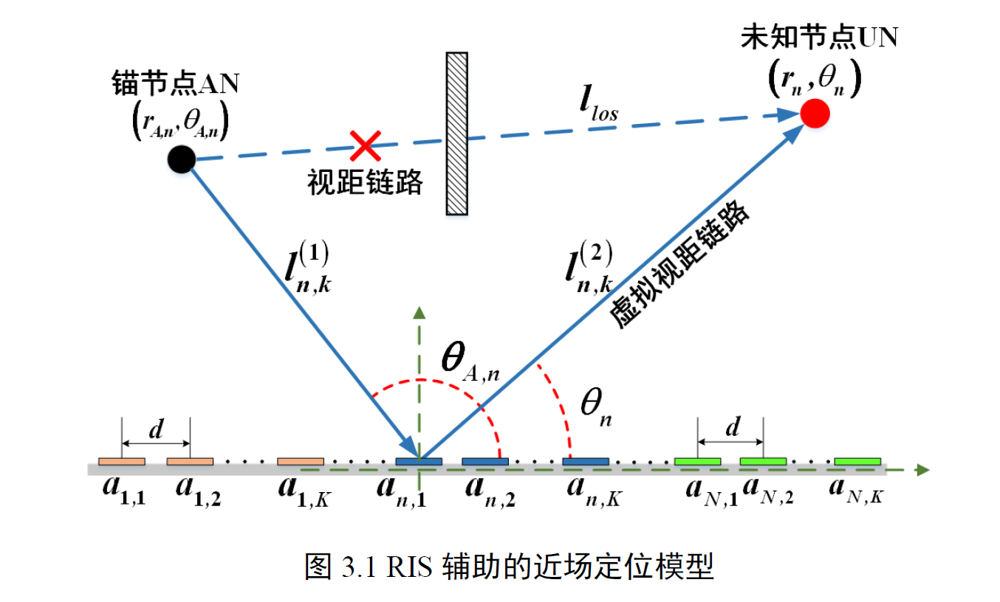

# 答辩素材

## 题目

面向6G自组织网络的协作定位关键技术研究

## 研究内容

### 1 基于参数修正的协作定位技术研究

> *这部分主要参考本科毕设答辩PPT*

#### 1.1 基于卡尔曼滤波的RSSI测距模型参数修正算法

*卡尔曼滤波的介绍部分可以参考论文《基于可重构智能表面的RSS定位算法研究》*

#### 1.2 基于加权的三边定位算法优化方案

### 2 基于近场通信模型的协作定位技术研究

> *参考文献：近场通信与定位：从球面波前模型到电磁场理论*

#### 2.1 近场的研究目的

在未来的无线网络中，大型的天线阵列和更高的载频将会促使无线信号的电磁衍射域从远场转移到近场，相应的通信和定位问题也由远场转移到近场。

下一代无线通信系统（如6G） 有如下关键特征：更高的数据传输速率、更大的信道容量、超高的安全性和可靠性、超低的延迟和良好的可扩展性。为了实现以上特征，一方面，毫米波（30～300 GHz） 和太赫兹（0.1～10 THz）作为新的频谱将被进一步开发；另一方面，接收和发射天线的部署将朝着具有大量可精细定制天线的新范例发展，天线单元的数量向百量级甚至千量级发展。

更高的载频以及收发天线阵列的大型化会使无线信号的电磁衍射域从远场转移到近场。那么，在传统的远场通信中所做的均匀平面波前假设将不再成立。基于该假设建模近场信道将会对近场通信和定位造成重大性能损失。近年来，基于近场信道的通信和定位问题已成为研究热点。

一般来说，近场（Near-Field，NF）区域辐射的信号强度较大，且相较于远场区域信号传输过程会受到较少的干扰和衰落，因此**近场条件对基于RSS的定位是非常有利的**

*这里展示一下范围划分、球面波和平面波的图片*

#### 2.2 研究内容

- 使用近场球面波前模型去修正传统的远场定位模型与算法

  对于远场信源定位，信源的传输模型被假设为[平面波](https://www.zhihu.com/search?q=%E5%B9%B3%E9%9D%A2%E6%B3%A2&search_source=Entity&hybrid_search_source=Entity&hybrid_search_extra=%7B%22sourceType%22%3A%22article%22%2C%22sourceId%22%3A%22658139196%22%7D)，仅用到达方向 (DOA, direction of arrival) 就可以完成信源定位的任务。在过去的几十年中，学者们提出了很多针对远场 DOA估计的经典算法。例如[最大似然法](https://www.zhihu.com/search?q=%E6%9C%80%E5%A4%A7%E4%BC%BC%E7%84%B6%E6%B3%95&search_source=Entity&hybrid_search_source=Entity&hybrid_search_extra=%7B%22sourceType%22%3A%22article%22%2C%22sourceId%22%3A%22658139196%22%7D)，多重信号分类 (MUSIC, multiple signal classification) 算法，[旋转不变技术](https://www.zhihu.com/search?q=%E6%97%8B%E8%BD%AC%E4%B8%8D%E5%8F%98%E6%8A%80%E6%9C%AF&search_source=Entity&hybrid_search_source=Entity&hybrid_search_extra=%7B%22sourceType%22%3A%22article%22%2C%22sourceId%22%3A%22658139196%22%7D) (ESPRIT, estimation of signal parameters via rotational invariance technique) 方法。对于近场信源定位，信源的传输模型被假设为[球面波](https://www.zhihu.com/search?q=%E7%90%83%E9%9D%A2%E6%B3%A2&search_source=Entity&hybrid_search_source=Entity&hybrid_search_extra=%7B%22sourceType%22%3A%22article%22%2C%22sourceId%22%3A%22658139196%22%7D)，需要估计信源的DOA和距离才可以完成信源定位的任务。针对近场DOA估计，学者们提出了二维近场MUSIC算法，[ESPRIT高阶近场估计算法](https://www.zhihu.com/search?q=ESPRIT%E9%AB%98%E9%98%B6%E8%BF%91%E5%9C%BA%E4%BC%B0%E8%AE%A1%E7%AE%97%E6%B3%95&search_source=Entity&hybrid_search_source=Entity&hybrid_search_extra=%7B%22sourceType%22%3A%22article%22%2C%22sourceId%22%3A%22658139196%22%7D)，以及一些在MUSIC和ESPRIT算法基础上改进的算法。

  - 近场定位信号的建模：用球面波前模型去描述近场信号
    - 用公式展示调研结果，参考《近场通信与定位：从球面波前模型到电磁场理论》
  - 近场定位算法的设计：用近场球面波前模型去修正传统的远场定位算法
    - 改进的近场二维多重信号分类（MUSIC） 算法
    - 近场全局最优最大似然（ML） 搜索方法
    - 近场旋转不变（ESPRIT） 算法
    - 以上三个算法是各种远场定位算法的近场修正，每个都展开讲一点点
    - 参考《近场信源定位算法研究》

### 3 可重构智能超表面辅助的近场协作定位技术研究

#### 3.1 为什么引入RIS

现有的静态和动态目标定位研究大多依赖于远场和视距条件，但在实际场景中目标未必处于阵列的远场区域，且目标之间的视距链路不一定存在。当目标处于阵列的近场区域且缺少视距链路时，传统定位算法的性能可能会下降甚至失效。 因此，如何在近场且视距链路缺失条件下实现对目标的精准定位是亟待解决的问 题。 近两年来，可重构智能表面作为一种新兴的技术受到了无线通信领域的广泛关注，其突出优势是能够控制表面上每个元素的幅度和相位来独立地反射入射信号。当节点之间的视距链路被障碍物严重阻塞时，可重构智能表面可以在节点之间创建虚拟视距链路使信号绕过障碍物，从而有效解决由视距链路缺失而造成的 定位性能下降的问题。

针对视距链路缺失的通信环境，一种被称为可重构智能表面的新技术能够有效地解决这一问题[73-74]。可重构智能表面通过集成大量低成本的被动反射元件，实现对通信信道的动态改变，以达到定制无线电环境的目的[75]。与天线阵列有所不同，可重构智能表面可以构建虚拟视距链路从而绕过障碍物，提高通信传输效率和定位服务的准确性。可重构智能表面的每个元素均可通过调整反射系数，即振幅和相位，将信号聚焦到某一预定的方向。具体来说，当可重构智能表面受到电磁波撞击时会产生感应电流，接着通过调整二极管的偏置电压就可以改变幅度和相位，使反射信号朝向用户。

- 图片来自论文《基于可重构智能表面的RSS定位算法研究》

在移动通信场景下，由于智能超表面具有改变恶劣电磁传播环 境的特性，可以有效地对抗无线信道衰落对通信的不利影 响，极大提升系统通信性能；针对感知任务，智能超表面 的部署能扩大网络覆盖范围，利于感知设备的接入，并且 智能超表面可以作为参考锚点，使得从信道状态信息中挖 掘潜在的感知信息成为可能；

静态部署的多个RIS 可以替代多基站作为参考锚点，并且系统能融合多路测量实现单基站高精度定位。

无线定位技术的关键目标在于提高定位的可靠性。5G以及未来无线通信系统以极高的工作频率和大规模天线阵列，为实现超高精度定位提供了发展机遇。近年来，基于大规模天线阵列的定位技术也被认为是实现超高精度定位的前景技术。然而，复杂环境下的空间中的阻塞以及信号在高频段严重的路径传播损耗，依旧限制了超高精度定位的实现。

可重构的智能反射面（Reconfigurable Intelligent Surface，RIS）是一种低硬件成本、低功耗的辅助通信设备，**可以覆盖在各种建筑物外表面**。RIS可以通过调整其反射系数来实现智能可控的无线信道传播环境，还可以为发射机与接收机构建稳固的反射通信链路。因此，将RIS与无线定位系统相结合，**不仅可以克服由障碍物造成的通信阻塞，还可以在一些恶劣环境下（例如室内、树林和地下隧道等）实现对用户的高精度定位**。

实现超可靠无线通信的一个挑战在于用户所处的时变无线信道。传统的解决方法可以通过调制、编码和分集等
技术来补偿信道衰落，或者通过自适应功率、速率控制以及波束赋形技术来适应信道衰落。然而，这些技术仍然将无线环境视为一个随机动态的不可控因素，因此无法实现未来6G 无线通信网络的高容量和超可靠无线通信的目标。对此，我们急需开发革命性的新技术来克服传播信道的随机性，以满足未来无线网络对延迟、可靠性和连接性等方面的需求。为此，RIS 被认为是一种有前途的低成本技术，可用于构建6G 无线通信系统中能够灵活控制的智能可重构无线传播环境。(来自论文《可重构智能表面辅助的通信感知一体化系统》)

#### 3.2 研究内容

- RIS辅助下的信道与信号模型
  - 参考论文《RIS辅助毫米波通信系统中的三维定位与信道估计方法研究》
- 适用于分布式RIS辅助下的定位方案
  设计RIS辅助的联合最大似然协作定位算法，参考论文《基于RIS辅助的协同定位技术研究》
- 性能指标分析
