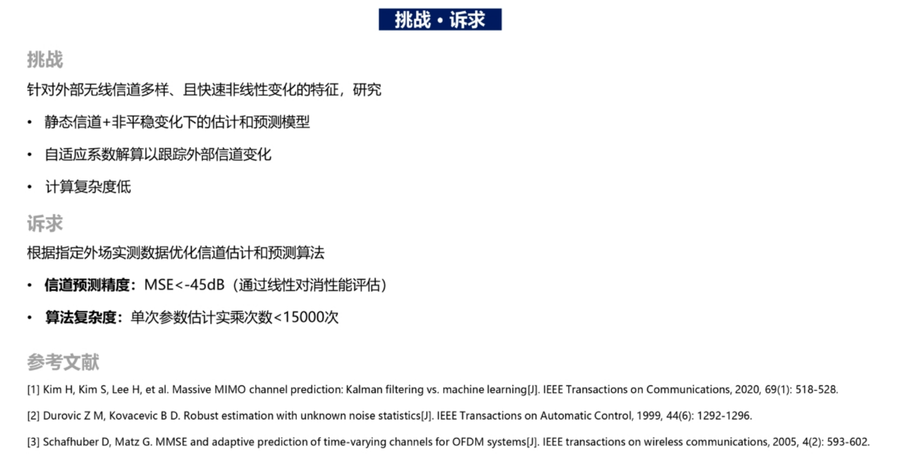

# 高铁传输能力提升-文献调研

# 1 背景说明

尊敬的杨少石教授，您好
先自我介绍一下，我是上海华为FDD解决方案部的于龙，近期负责高铁场景容量的研究，旨在研究如何进一步克服高速带来的性能损失，提升系统容量，增强FDD在高铁场景的竞争力；
从我个人理解而言，相比于低速场景，高速移动场景下，多普勒频移大，信道相干时间短，测量反馈周期内信道信息老化严重，预编码权值与实际信道不再匹配，如何在相干时间远小于测量反馈周期的高铁场景下，及时获得准确的高铁信道信息是十分困难的，因此据我了解，目前针对高速时变信道主要采用基于卡尔曼滤波等传统算法，或者基于神经网络的AI算法实现信道预测，获得瞬时信道信息，达到了一定的预测精度，但为了进一步提升高铁场景FDD系统容量，如何结合高铁场景特有的轨迹固定特征，实现高精度FDD信道预测，并配合高速场景MU（多用户）配对算法与MU权值设计、以及高速场景链路自适应算法，使能高速场景系统容量大幅提升，逼近低速场景系统，是我们部门当前要回答的问题。
和我司负责高校合作的同事交流后，了解到杨教授在高速移动通信，AI在无线通信与网络中的应用等领域研究颇深，因此在这个领域想听听您的一些专业见解和观点，看看后续是否有合作的可能。
如果可以，我们另约时间详谈一下，谢谢。
顺颂秋褀。

# 2 调研要求

大家调研一下现在相关文献的方法，关键词及其组合，high mobility， channel prediction，channel estimation，massive MIMO, FDD, high speed railway，禹松来组织一下，七个人，每人调研两年的，从2009到2023年一共14年的。调研输出材料是ppt；主要选择引用次数相对高的期刊论文等，涵盖IEEE Xplorer数据库文献，相关专利，国内外企业的研究报告和解决方案，知网的中文期刊和博硕士学位论文等。

一些技巧：优先关注国内外信道建模领域的主要团队的工作，包括美国南加州大学 Andreas Molisch教授，北京交通大学相关团队，北邮张建华老师团队，西南交大相关团队；优先阅读一些高质量综述文章；优先阅读高引文章

# 3 相关内容

## 3.1 动态干扰信道预测——非平稳环境下的参数估计

这个是华为刚发布的一个难题榜命题，和这个需求类似的

主要分为传统基于导频、导频/数据混合等的参数估计方法，以及基于AI, 卡尔曼滤波类算法，轨迹可预测性等，来实现信道预测

## 3.2 老师指导

### 3.2.1

大家首先要理解FDD系统信道估计基本原理：上下行信道频段不同，不能像TDD那样直接用信道互易性（reciprocity），所以下行信道要做预编码或波束赋形时，所需的下行CSI，一般是由终端估计后反馈给基站，这里的反馈涉及CSI的量化（模拟值转换成二进制表示，massive MIMO下要用很多比特，开销很大）；第二，由于高速移动，信道一般是快速时变的，CSI估计值会很快过期，所以也需要很多导频开销。

现在就是想怎么降低反馈和导频开销，同时提高估计精度，比如是否能通过AI或高铁特有的轨迹可预测性等等，实现这个目标

### 3.2.2

[科学前沿|电信学院尹海帆教授团队破解5G移动性诅咒 (qq.com)](https://mp.weixin.qq.com/s/zl6xvHpt1wQcPfJ3M_avrA)

> 我原来华为同事，这个成果所依托的项目，本来是我负责的，我离职时把阶段性成果和项目交接给了他，半年后他也辞职了，但项目成果他拿了，你们也重点关注一下这个论文
