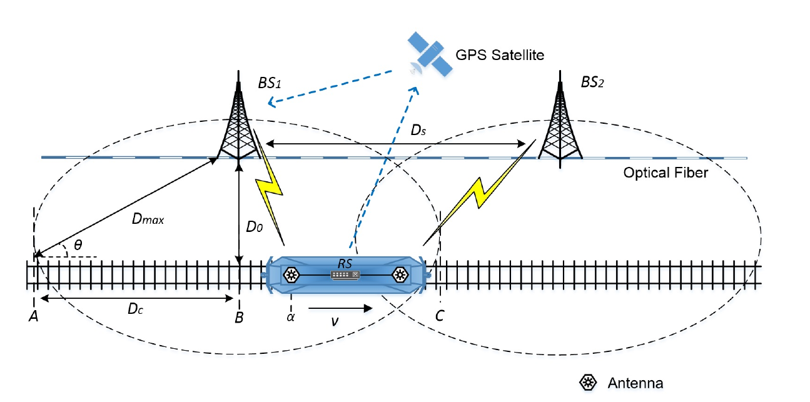
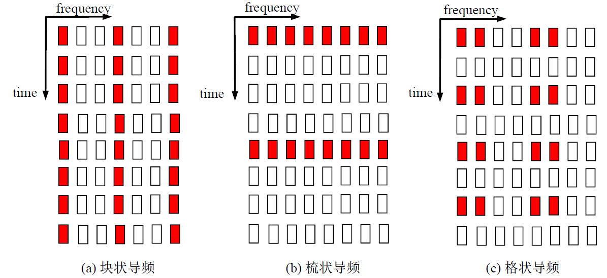
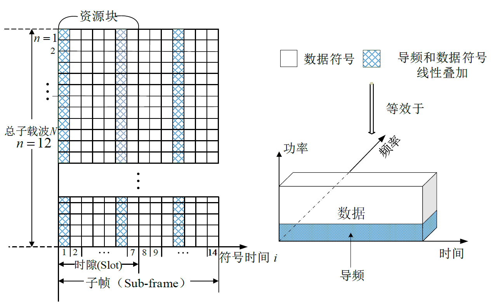

# PPT思路

# 问题

- 时变信道，如高铁无线通信信道，较大的多普勒效应和丰富的多径效应会产生严重的子载波间干扰
- 导频开销大
- 如何在未来更高速的HSR 场景下快速获取高精度和低复杂度的信道信息是一个亟待解决的问题
- 高移动性带来的问题主要体现在无线信道中的频率选择性和时间选择性衰落的影响不可忽略，其中频率选择性和时间选择性衰落分别由信道中的多径效应和多普勒频移导致的，这类信道可以称为双选衰落信道。在双选信道下传统通信系统将会面临一下的挑战：
  - 快速时变衰落
  - 信道估计误差
  - 载波频率偏移
  - 快速和频繁的切换

# 现状

## 1 初版

- 信道模型
  - 双选信道
  - BEM
- 信道估计
  - 深度学习
  - 压缩感知
  - 减少导频资源占用
  - 根据是否有先验信息进行分类
    - 导频辅助的估计方法
    - 盲估计方法
    - 半盲估计方法
- OTFS
- 信道预测
  - 人工智能

## 2 详细版

- 信道建模 **3p**

  - 确定性信道建模
    - 射线追踪
    - 在传统射线追踪模型的基础上，提出基于随机图论的密集散射体表征方法
  - 统计性信道建模
  - 参考文献《高速铁路场景快速时变信道特性分析与建模方法研究》
  - 参考文献《高速移动场景中基于MIMO-OFDM的信道估计和预编码方法研究》
- 信道估计

  - 信道估计技术的分类 **1p**
    - 全盲估计
    - 半盲估计
    - 基于导频的信道估计
    - 前两类估计技术主要利用接收信号的统计特性、循环前缀、虚拟载波、以及接收分集等技术实现。然而，由于较低的收敛速度，全盲和半盲信道估计方法通常要求信道在多个符号内保持稳定，因此，这两类估计技术不适用于高移动场景。目前，基于导频的信道估计方法因能在高移动场景中获得更稳定的信道估计性能而被许多主流通信标准所采用
    - 参考文献《高移动性信道估计及干扰抑制技术研究》
  - 高速移动场景下的信道估计算法主要分为三类 **3p**
    - 线性近似的方法
    - 基于压缩感知的方法
    - 基扩展模型的方法
    - 参考文献《高移动性信道估计及干扰抑制技术研究》，里面介绍了上述三种方法之间的关系
- 针对FDD **2p**

  - 终端用户需要根据下行发送的导频信号估计出信道，进一步计算处信道状态信息CSI，并通过反馈信道传输给基站端。基站通过解调承载CSI的数据信道，获取终端上报的信道状态信息。
  - 当终端用户处于高速运动的时候，无线信道快速时变。基站收到终端上报的信道状态信息，通过优先级排序策略决定要调度该用户的时候，信道已经发生变化，信道与发射参数就会失配，从而导致系统传输性能下降。
  - 一种解决问题的思路是缩短终端用户上报CSI的周期，这种方法对移动速度不是很高的场景是有效的，代价是增加了用于测量CSI的导频符号的开销，且CSI的频繁上报占用了大量的上行资源。
  - 使用**信道预测的技术可以获得基站发送数据时刻的信道信息，是一种很好的解决方案**。信道预测技术可以在信道估计的基础上，进一步获取未来时刻的CSI，克服了信道状态信息反馈和基站调度用户时延，在保证较低的导频开销和上行资源开销的基础上，获得自适应传输技术带来的高性能
  - 参考文献《基于压缩感知的MIMO系统稀疏信道估计方法研究》
- 信道预测

  - 由于CSI老化（高速移动导致的，同时也会导致FDD下行链路估计性能下降）导致的系统下降问题有三类方法 **1p**
    - 被动性能补偿法
    - 次优自适应传输方法
    - 信道预测法 √
    - 参考文献《高速移动场景中基于MIMO-OFDM的信道估计和预编码方法研究》
    - 参考文献《面向B5G高速移动通信系统的信道预测方法研究》
  - 信道预测方法大致分为三类 **3p**
    - 基于参数模型的信道预测
      - 将时变信道的估计转变为时不变参数估计
        - 以Jakes信道模型为例，无线信道在时域变化被建模为有限个复正弦函数的加权和
    - 基于自回归模型的信道预测
      - 信道在时域的变化被建模为宽平稳随机过程，通过一阶或多阶来预测信道的变化
      - 结构简单、计算量小，尤其是当阶数较小的时候，实现复杂度非常低。缺点是在终端用户移动速度较高的时候，预测性能差
    - 基于机器学习的信道预测
    - 参考文献《高速移动场景中基于MIMO-OFDM的信道估计和预编码方法研究》
- ICI抑制 **1p**

  - 终端处于高速运动时，ICI严重影响OFDM系统的性能。在MIMO-OFDM系统中，这个问题更加严重，因为子载波间干扰和不同的发射天线的信号在接收端混叠在一起，难以区分
  - 抑制ICI的技术大致可以分为如下几类：
    - 干扰自消除
    - 时域加窗
    - 脉冲成形
    - 频域均衡

# 创新思路 2-3p

1. 基于深度学习的信道估计方法都是基于数据驱动的深度学习算法，这种方法严重依赖于大量的历史数据。然而在实际的通信过程中，想要获得大量的历史数据并不是一件容易的事。基于模型驱动的深度学习不仅可以减小网络对历史数据的依赖程度，而且一般这种方法具有更好的可解释性

# 可能用到的图

